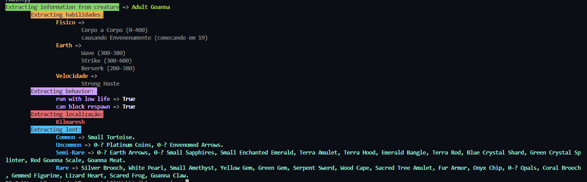

<h1 align="center">TWIKI-SCRAPPING</h1>

<p align="center">Visa obter dados necessários do fã site TibiaWiki.com.br em formato JSON</p>

<p align="center">
  <a href="#Objetivo">Objetivo</a>
  <a href="#Pré-requisitos">Pré-requisitos</a>
  <a href="#Rodando o script">Rodar o Script</a>
  <a href="#Exemplo">Exemplo</a>
  <a href="#Autor">Autor</a>
</p>

<h4 align="center">
  Em construção...
</h4>

### Objetivo

 Obter uma especíe de biblioteca em JSON removida do fã site TIbiaWiki.com.br e para fins de estudos, tanto das ferramentas quanto de como utilizar o arquivo gerado em algum projeto futuro.

### Features
- [x] HP e EXP
- [x] Charms e Dificuldade
- [x] Localizações
- [x] Comportamentos
- [x] Habilidades / Spells
- [x] Loot / Drop
- [ ] Imunidades
- [ ] Passa por
- [ ] Pode ser Puxado
- [ ] Empurra Objetos
- [ ] Status de Defesa
- [ ] Archfoe
- [ ] Sons

### Pré-requisitos
Ferramentas necessárias:
  [Python](https://python.org/)
    - [x] beautifulsoup4 == 4.11.1
    - [x] requests == 2.27.1
    - [x] termcolor == 2.0.1
    - [x] Unidecode == 1.3.6

### Instalando as ferramentas:
> pip3 install -r requeriments.txt

### Rodando o script

```
# Clone este repositório
$ git clone <https://github.com/mathiconical/twiki-scrapping>

# Acesse a pasta do projeto via terminal / cmd
$ cd twiki-scrapping

# Execute o comando
$ python main.py

# Caso queira desabilitar o esquema de cores, use este comando
$ python main.py --nocolor

# Caso queira desabilitar o modo de mensagens, use este comando
$ python main.py --nomsg

# O script começará a realizar requisições e no final irá salvar tudo em um JSON no local de execução do script. ( Este processo pode demorar )
```

### Exemplo
>


### Autor
---

<a href="https://www.linkedin.com/in/jos%C3%A9-maria-oliveira/">
  
  <br />
  <b>José Maria Neto</b></a>

  [](mailto:netinho340@gmail.com)


### Licença
MIT
